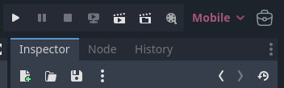
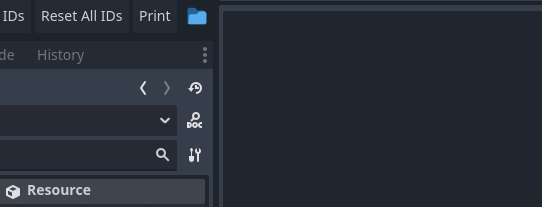

# AutoAssignIDs Plugin for Godot 4.4

This plugin automatically assigns unique IDs to resources and its subclasses saved as `.tres` files.

**Note:** Your root item script should include `@export var ID: int = -1`.

## Features

- **Automatic ID Assignment:** Detects and fixes duplicate/missing IDs.
- **Manual & Auto Refresh:** Trigger refresh manually or set a configurable check interval.
- **Folder Management:** Easily add/remove folders to scan for `.tres` files with specified `class_name` root.
- **Options:**
  - **Refresh IDs:** Resets only item IDs that are lower than 0.
  - **Reset ALL IDs:** Sets all IDs to -1 and refreshes them.
- **Scanning:** Folders are scanned recursively, sorted alphabetically, and prioritized.
- **Saving:** All your UI changes are saved.

## Installation

1. Place the plugin folder in your project's `res://addons/` directory.
2. Enable it in **Project Settings > Plugins**.
